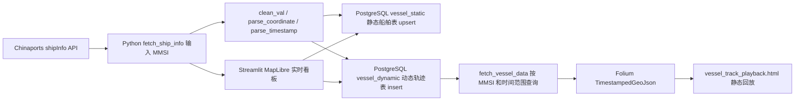

# 当前项目状态审计

审计时间：2026-08-02  
审计范围：`获取船舶地理位置【已开发完成】`、`船舶坐标管理、历史轨迹回放`，并参考直接调用这些模块的前端脚本。  
操作性质：只读审计。未修改源代码、配置、依赖或数据库数据。仅创建本报告文件。  
数据库运行状态：未验证。使用只读事务尝试连接 PostgreSQL 失败，返回 `OperationalError`；未执行任何写入 SQL。

## 1. 项目摘要

这个项目目前已经具备“按 MMSI 查询单船实时位置”和“把船舶静态信息、动态轨迹点写入 PostgreSQL 的脚本级流程”。也已经有一个 Streamlit/MapLibre 实时看板，可以添加 MMSI、查看当前位置，并通过按钮把当前动态位置写入数据库；另有一个 Folium 脚本可以从 PostgreSQL 读取某船过去 N 小时轨迹，生成一个静态 HTML 时间轴回放地图。

目前还不能确认它是一个可持续运行的完整应用：没有 README、没有数据库 migration、没有 ORM 模型、没有测试、没有可验证的 PostgreSQL 表结构、没有幂等轨迹写入、没有分页/抽稀、没有生产部署配置。历史轨迹回放是独立脚本生成 HTML，不是已集成到主前端的交互式功能。

## 2. 当前开发阶段

总体判断：2级，本地功能原型。部分脚本接近 3级的结构化本地应用，但数据库 schema、测试、运行说明、部署和质量保障不足。

| 模块 | 阶段 | 判断 | 证据 |
| --- | --- | --- | --- |
| 船舶当前位置获取 | 2级 | 代码已实现但未运行验证 | `fetch_ship_info(mmsi_id)` POST 到 `https://ship.chinaports.com/ShipInit/shipInfo`，输入 `userid=mmsi_id`，30 秒超时。见 `获取船舶地理位置【已开发完成】/fetch_ship_location.py:13`、`:15`、`:34`、`:45`。 |
| 船舶坐标管理 | 2级 | 部分实现 | 有坐标解析、清洗、静态表 upsert、动态表 insert；没有统一领域模型、校验边界、唯一约束定义或 migration。见 `loading_to_postgresql.py:25`、`:33`、`:56`、`:76`、`:145`。 |
| 历史轨迹保存 | 2级 | 代码已实现但未运行验证 | `vessel_dynamic` 每次直接 insert，包含 `record_time`。见 `loading_to_postgresql.py:193`。数据库运行和表结构未验证。 |
| 历史轨迹回放 | 2级 | 部分实现 | Folium 脚本按 MMSI 和过去小时数查询，`ORDER BY record_time ASC`，生成 `vessel_track_playback.html`。见 `船舶航迹回放.py:50`、`:70`、`:77`、`:176`、`:225`。 |
| 自动定时采集 | 2级 | 代码已实现但未运行验证 | `schedule.every(10).minutes.do(job)`，从静态表读取 MMSI。见 `automatic_fetch_dynamic_data.py:11`、`:24`、`:85`。没有守护进程、部署或失败恢复。 |
| 数据库设计 | 1级 | 部分实现 | 代码假设存在 `"Marine Risk".vessel_static` 和 `"Marine Risk".vessel_dynamic`；未发现 SQL/migration/ORM。 |
| 云端部署 | 1级 | 仅有其他模块云端线索 | 仅发现 OFAC GitHub Actions 和 Supabase 环境变量示例，不是船舶定位部署。见 `.github/workflows/ofac-sync.yml:1`、`:34`。 |
| 测试与质量 | 1级 | 部分实现 | 目标脚本 AST 语法检查通过；未发现测试文件或 pytest 配置。 |
| 安全与密钥管理 | 2级 | 部分实现 | 代码使用环境变量读取 DB 和 Cookie；但存在实际 `.env` 文件，报告未读取秘密值。见 `.env.example`、`loading_to_postgresql.py:14`、`fetch_ship_location.py:16`。 |

等级含义：0级只有想法或需求；1级单个脚本能够运行；2级本地功能原型；3级结构稳定的本地应用；4级可以持续运行的云端 MVP；5级具备监控、安全和恢复能力的生产系统。

## 3. 已实现功能清单

| 功能 | 状态 | 用户可以做什么 | 代码入口 | 关键文件与行号 | 是否经过运行验证 |
| --- | --- | --- | --- | --- | --- |
| 按 MMSI 获取船舶信息 | 代码已实现但未运行验证 | 输入 MMSI，向 Chinaports 接口请求船舶信息 | `fetch_ship_info` | `获取船舶地理位置【已开发完成】/fetch_ship_location.py:13` | 否；仅 AST 检查通过 |
| API Cookie 从环境变量读取 | 已验证 | 不在代码中硬编码 Cookie | 环境变量 `CHINAPORTS_COOKIE` | `fetch_ship_location.py:16`、`.env.example` | 是；只读代码验证 |
| 坐标字符串转十进制度 | 已验证 | 把 `N 80度39.7752分` 形式转为 float | `parse_coordinate` | `loading_to_postgresql.py:56`、`legacy/dashboard-opengridwork.py:98` | 是；代码验证，未跑单元测试 |
| 时间字符串解析 | 已验证 | 把接口 `timeStamp` 解析为 `datetime`，失败时用当前时间兜底 | `parse_timestamp` | `loading_to_postgresql.py:33`、`:53` | 是；代码验证 |
| 静态船舶数据 upsert | 代码已实现但未运行验证 | 将 MMSI、IMO、船名、呼号、船长宽、总吨写入静态表 | `upsert_vessel_static_data` | `loading_to_postgresql.py:76`、`:114` | 否；数据库未连通 |
| 动态位置点保存 | 代码已实现但未运行验证 | 将经纬度、航速、航向、目的地、状态、观测时间写入动态表 | `upsert_vessel_dynamic_data` | `loading_to_postgresql.py:145`、`:193` | 否；数据库未连通 |
| 实时船队看板 | 部分实现 | 在 Streamlit 中添加 MMSI、查看地图点、手动写入当前动态轨迹 | Streamlit 脚本 | `legacy/dashboard-opengridwork.py:130`、`:181`、`:351`、`:419` | 否；未启动前端 |
| 自动 10 分钟采集 | 代码已实现但未运行验证 | 周期性读取静态表中的 MMSI 并抓取入库 | `automatic_fetch_dynamic_data.py` | `automatic_fetch_dynamic_data.py:39`、`:85` | 否；未启动长进程 |
| 历史轨迹查询 | 代码已实现但未运行验证 | 按 MMSI 和过去小时数查询轨迹 | `fetch_vessel_data` | `船舶航迹回放.py:50`、`:70`、`:77` | 否；数据库未连通 |
| 历史轨迹 HTML 回放 | 部分实现 | 生成 Folium 时间轴 HTML | `generate_track_playback` | `船舶航迹回放.py:97`、`:176`、`:225` | 部分；仓库已有生成后的 HTML，但未重新运行 |
| 船旗/国家字段管理 | 部分实现 | JSON 文件读取中支持 `iso_code/country_iso`，但主入库流程未保存船旗 | `vessel_manager.py` | `vessel_manager.py:6`、`:31` | 是；代码验证 |

## 4. 系统架构与数据流

真实流程不是一个统一后端服务，而是多个脚本直接调用外部 API 和 PostgreSQL。当前没有独立 API 层、ORM 层或任务队列。

## 5. 船舶位置采集分析

位置来源：Chinaports `https://ship.chinaports.com/ShipInit/shipInfo`，POST 表单调用。见 `fetch_ship_location.py:15`、`legacy/dashboard-opengridwork.py:79`。

输入标识：主要输入是 MMSI，但参数名为 `userid`。见 `fetch_ship_location.py:34`。代码会读取返回中的 `mmsi`、`imo`、`shipname`、`callsign` 等字段。见 `loading_to_postgresql.py:85`、`:90`、`:91`、`:92`。

返回字段使用情况：动态字段包括 `latitude`、`longitude`、`trueHeading`、`cog`、`sog`、`eta`、`destination`、`draught`、`navStatus`、`timeStamp`。见 `loading_to_postgresql.py:158` 到 `:168`。

采集方式：既有手动，也有自动。手动来自脚本直接运行和 Streamlit 按钮；自动来自 `schedule.every(10).minutes.do(job)`。见 `fetch_ship_location.py:63`、`legacy/dashboard-opengridwork.py:181`、`automatic_fetch_dynamic_data.py:85`。

批量支持：自动任务会从 `"Marine Risk".vessel_static` 读取所有 MMSI；如果为空，使用 3 个硬编码测试 MMSI。见 `automatic_fetch_dynamic_data.py:24`、`:49`。

限流、超时、重试：有 10 秒或 30 秒请求超时；没有明确重试、指数退避、429 处理或服务端限流。自动任务每船 sleep 1.5 秒。见 `fetch_ship_location.py:45`、`legacy/dashboard-opengridwork.py:91`、`automatic_fetch_dynamic_data.py:72`。

重复写入风险：动态表 insert 没有 `ON CONFLICT`，代码仓库也没有 migration 定义唯一约束，因此同一 MMSI 同一 `record_time` 可能重复写入。见 `loading_to_postgresql.py:193`。

数据过期判断：没有显式过期规则。只在历史查询中使用 `record_time >= NOW() - INTERVAL '{hours_back} hours'`。见 `船舶航迹回放.py:74`。

## 6. 数据库现状

数据库运行状态未验证。未发现 SQL、migration、ORM、Alembic 或 schema 文件；以下仅根据代码中的 SQL 推断。

| 表 | 用途 | 主键 | 重要字段 | 唯一约束 | 索引 | 写入方 | 读取方 |
| --- | --- | --- | --- | --- | --- | --- | --- |
| `"Marine Risk".vessel_static` | 船舶静态资料 | 无法判断；代码要求 `mmsi` 可冲突处理 | `mmsi`, `imo`, `ship_name`, `callsign`, `length`, `width`, `ship_all_dun` | 代码依赖 `ON CONFLICT (mmsi)`，但实际约束未验证 | 未发现定义 | `upsert_vessel_static_data`、Streamlit 添加船舶、自动完整写入 | 自动任务读取 MMSI；轨迹回放读取船名 |
| `"Marine Risk".vessel_dynamic` | 船舶动态位置/历史轨迹点 | 无法判断 | `mmsi`, `lat`, `lon`, `heading`, `cog`, `sog`, `eta`, `destination`, `draught`, `nav_status`, `record_time` | 未发现 | 未发现 | `upsert_vessel_dynamic_data`、自动任务、Streamlit 手动按钮 | `fetch_vessel_data` 历史回放 |

专项检查：

| 检查项 | 判断 | 证据 |
| --- | --- | --- |
| 时间是否带时区 | 无法判断 | `parse_timestamp` 返回 Python naive `datetime`，SQL schema 未验证。见 `loading_to_postgresql.py:47`。 |
| 当前船位和历史船位是否分开 | 部分实现 | 静态表和动态表分开；没有单独 current_position 表。最新位置需要从动态表按时间取或实时 API 取。 |
| 是否保存观测时间和系统接收时间 | 部分实现 | 保存接口 `timeStamp` 解析后的 `record_time`；没有 `received_at/created_at` 证据。 |
| 是否存在重复轨迹点风险 | 已验证 | 动态 insert 无冲突处理。见 `loading_to_postgresql.py:193`。 |
| 是否有船舶加时间组合索引 | 无法判断 | 未发现 migration；数据库未连通。 |
| 是否使用 PostGIS | 未实现或无法判断 | 代码使用普通 `lat/lon` 数值字段，未发现 `geometry/geography` 或 PostGIS migration。 |
| 是否支持以后迁移到 Supabase | 部分实现 | 使用 PostgreSQL 兼容 SQL 和环境变量，但 schema/migration/RLS/索引未准备。根配置存在 Supabase 变量，主要用于制裁模块。 |

## 7. 历史轨迹与回放能力

选择船舶和时间范围：脚本函数 `generate_track_playback(mmsi, hours_back=24)` 支持传入 MMSI 和小时数；命令行直接运行时写死测试 MMSI `413233370`。见 `船舶航迹回放.py:97`、`:231`。

排序：SQL 使用 `ORDER BY record_time ASC`，顺序正确。见 `船舶航迹回放.py:77`。

显示字段：回放点 popup 显示船名、时间、航速、航向；终点 popup 也显示这些字段。见 `船舶航迹回放.py:152`、`:202`。

异常点和数据质量：没有重复点去重、异常跳点剔除、缺口检测、经纬度范围校验。`haversine_distance` 仅用于计算总距离。见 `船舶航迹回放.py:31`、`:106`。

加载方式：一次性读取过去 N 小时所有符合条件的数据到 Pandas DataFrame，没有 limit、分页或抽稀。见 `船舶航迹回放.py:70`、`:79`。

性能风险：数据量增长后，`mmsi + record_time` 缺索引会导致慢查询；一次性构造所有 Folium features 会使 HTML 文件变大并拖慢浏览器。

前端地图组件：历史回放使用 Folium + Leaflet TimeDimension；实时看板使用 Streamlit + MapLibre；历史测试前端使用 Folium/streamlit-folium。见 `船舶航迹回放.py:5`、`:176`，`legacy/dashboard-opengridwork.py:275`，`历史测试前端/streamlit_dashboard.py:7`。

## 8. 运行方式

不要执行安装时，可按以下方式准备：

1. 所需环境：Python 3.12 左右、PostgreSQL、可访问 Chinaports 接口的网络环境。
2. Python 依赖：根目录 `requirements.txt` 包含 `requests`、`lxml`、`python-dotenv`、`supabase`、`pandas`、`streamlit`；但目标功能还实际使用 `psycopg2`、`schedule`、`folium`、`streamlit_folium`、`pydeck`，这些不在根 requirements 中。
3. 必需环境变量名称：`DB_NAME`、`DB_USER`、`DB_PASSWORD`、`DB_HOST`、`DB_PORT`、`CHINAPORTS_COOKIE`。不要把真实值写入代码或报告。
4. 数据库要求：需要 PostgreSQL 中存在 schema `"Marine Risk"`，并存在 `vessel_static`、`vessel_dynamic` 表；`vessel_static.mmsi` 需要唯一约束才能支持 `ON CONFLICT (mmsi)`。
5. 后端/脚本入口：当前位置获取 `python 获取船舶地理位置【已开发完成】/fetch_ship_location.py`；入库测试 `python 获取船舶地理位置【已开发完成】/loading_to_postgresql.py`；自动采集 `python 获取船舶地理位置【已开发完成】/automatic_fetch_dynamic_data.py`；历史回放 `python 船舶坐标管理、历史轨迹回放/船舶航迹回放.py`。
6. 前端入口：当前主看板为 `streamlit run risk_monitor/vessel_dashboard.py`；旧版看板已归档到 `legacy/dashboard-opengridwork.py`。
7. 最小验证步骤：先验证环境变量存在；再用一个 MMSI 调用实时接口；再确认静态表 upsert、动态表 insert；最后用同一 MMSI 生成历史回放 HTML。审计中未执行这些业务验证。

## 9. 测试与验证证据

已有测试：未发现 `tests/`、`test_*.py`、`*_test.py`、`pytest.ini` 或 `tox.ini`。

实际运行的安全测试：

| 测试 | 结果 | 说明 |
| --- | --- | --- |
| 目标 Python 文件 AST 语法解析 | 通过 | `fetch_ship_location.py`、`loading_to_postgresql.py`、`automatic_fetch_dynamic_data.py`、`vessel_manager.py`、`船舶航迹回放.py`、`legacy/dashboard-opengridwork.py` 等均可解析。 |
| `.venv` 依赖存在性检查 | 通过 | `.venv/bin/python` 可找到目标功能依赖：`requests`、`dotenv`、`psycopg2`、`schedule`、`pandas`、`streamlit`、`folium`、`streamlit_folium`、`pydeck`、`supabase`。 |
| 当前 shell Python 依赖检查 | 部分失败 | 当前 shell Python 找不到多个目标依赖，但 `.venv` 中存在。 |
| PostgreSQL 只读连接验证 | 失败 | 只读事务连接返回 `OperationalError`，数据库运行状态未验证。 |

核心功能未测试：真实 Chinaports API 调用、Cookie 有效性、PostgreSQL 写入、自动采集长时间运行、Streamlit 前端启动、Folium HTML 重新生成、地图外部 CDN 加载、批量船舶稳定性。

仅根据代码判断、未实际验证：当前位置获取、静态 upsert、动态轨迹保存、自动任务、历史轨迹查询和回放。

## 10. 技术债务和风险

| 严重程度 | 风险 | 文件证据 | 影响 |
| --- | --- | --- | --- |
| P0 | 动态轨迹重复写入风险 | `loading_to_postgresql.py:193` 直接 insert，无 `ON CONFLICT` | 自动任务重复采集或接口返回同一时间点时，会污染轨迹和距离统计。 |
| P0 | 数据库 schema 无版本化定义 | 未发现 SQL/migration/ORM；代码直接引用表 | 新环境无法可靠复现；迁移 Supabase 时风险高。 |
| P1 | SQL 使用 f-string 拼接查询参数 | `船舶航迹回放.py:61`、`:70` | MMSI 和 hours 参数未参数化，存在 SQL 注入和类型错误风险。 |
| P1 | 观测时间失败时用系统当前时间兜底 | `loading_to_postgresql.py:53` | 接口时间解析失败会伪造轨迹时间，影响历史回放和数据新鲜度判断。 |
| P1 | 根 requirements 缺少目标功能实际依赖 | `requirements.txt:1` 到 `:6`，但代码 import `psycopg2`、`schedule`、`folium` | 新环境按 requirements 安装后无法运行目标脚本。 |
| P1 | 当前船位和历史船位没有清晰读模型 | `vessel_dynamic` 只追加；无 current 表或最新点查询封装 | 前端依赖实时 API，不依赖数据库最新状态；历史和当前状态可能不一致。 |
| P1 | 缺少 mmsi + record_time 索引证据 | 未发现 migration；查询见 `船舶航迹回放.py:73`、`:77` | 数据增长后历史查询会变慢。 |
| P2 | 无分页、limit、抽稀 | `船舶航迹回放.py:70`、`:79` | 大时间范围会一次性加载全部数据，HTML 体积和浏览器性能不可控。 |
| P2 | 经纬度格式支持窄 | `loading_to_postgresql.py:64` | 如果接口返回十进制度或整数分钟格式，坐标会变成 `None`。 |
| P2 | 日志只有 print | `fetch_ship_location.py:52`、`loading_to_postgresql.py:137`、`automatic_fetch_dynamic_data.py:75` | 无结构化日志、告警、任务失败追踪。 |
| P2 | 自动任务无进程托管和恢复 | `automatic_fetch_dynamic_data.py:88` | 进程退出后不会自动恢复；没有云端调度证据。 |
| P3 | 历史回放未集成主前端 | `船舶航迹回放.py:225` 只保存 HTML | 用户需要运行脚本并打开文件，体验割裂。 |
| P3 | 船旗/国家未进入主数据库模型 | `vessel_manager.py:6`，`loading_to_postgresql.py:90` 到 `:96` | 船旗筛选和风险分析无法基于入库数据稳定使用。 |

## 11. 建议保留、重构和废弃的内容

| 内容 | 保留/重构/废弃 | 原因 | 依赖 | 推荐时机 |
| --- | --- | --- | --- | --- |
| `fetch_ship_info` 的 Chinaports 调用 | 保留 | 已有明确数据来源和 MMSI 输入 | `requests`、`CHINAPORTS_COOKIE` | 下一阶段前保留并加测试 |
| `parse_coordinate` | 重构 | 可用但格式单一，多个文件重复实现 | `re` | 建立共享数据清洗模块时 |
| `parse_timestamp` | 重构 | 失败兜底当前时间会污染历史数据 | `datetime` | 增加幂等写入前 |
| `vessel_static` / `vessel_dynamic` 分表思路 | 保留 | 静态资料和轨迹点分离方向正确 | PostgreSQL | 设计 migration 时 |
| 动态表无冲突 insert | 重构 | 需要按 MMSI + 观测时间等幂等 | PostgreSQL 唯一约束 | 自动采集前必须做 |
| `automatic_fetch_dynamic_data.py` | 重构 | 逻辑可用，但缺少配置化调度、恢复、日志 | `schedule`、DB | 云端 MVP 前 |
| `船舶航迹回放.py` | 保留并重构 | 已有回放原型，但 SQL 拼接、无分页抽稀 | `psycopg2`、`folium` | 接入前端前 |
| `船舶数据传入PostgreSQL.py` 空文件 | 废弃或补齐说明 | 文件大小为 0，无功能证据 | 无 | 清理项目结构时 |
| `vessel_track_playback.html` | 保留为样例产物 | 证明曾生成过回放 HTML，但不是源码能力本身 | Leaflet CDN | 写入 docs 或 examples 后 |
| `legacy/dashboard-opengridwork.py` | 重构 | 是历史实时前端，但混合 API、DB 写入和 HTML 注入 | Streamlit、MapLibre | 分离采集和 Web 应用时 |

## 12. 下一阶段的前置条件

1. 稳定领域数据模型：明确 vessel、current_position、position_history 的职责。
2. 增加 PostgreSQL/Supabase migration：包含 schema、主键、外键、唯一约束、索引和字段类型。
3. 增加幂等写入：至少约束 `mmsi + record_time` 或引入供应商观测 ID。
4. 补充组合索引：历史查询需要 `mmsi, record_time`。
5. 分离数据库访问层：避免前端脚本直接拼 SQL 或直接承担写入逻辑。
6. 分离采集任务与 Web 应用：采集应成为独立 worker/cron，而不是依赖按钮或本地长进程。
7. 补充测试：坐标解析、时间解析、入库 SQL 参数、重复点处理、历史查询排序。
8. 明确过期策略：区分观测时间、系统接收时间和数据新鲜度。
9. 准备 Supabase migration：如使用 Supabase，需要 RLS、service role 使用边界、环境变量分层。
10. 补齐运行文档和依赖清单：根 requirements 应覆盖目标功能，README 应说明入口和数据库准备。

## 13. 待用户确认的问题

1. Chinaports 是否是长期允许使用的数据来源，Cookie 获取和刷新机制是否合规、稳定？
2. 船舶唯一身份以 MMSI 为主，还是需要 IMO 作为跨 MMSI 变更的主身份？
3. 历史轨迹保留周期、采样频率和预期船队规模是多少？
4. 当前船位是否必须来自数据库最新点，还是允许前端实时调用外部 API？
5. 目标云端是 Supabase 还是自建 PostgreSQL？是否需要 PostGIS？
6. 船旗字段来源应来自接口、MMSI MID 映射，还是外部船舶静态资料库？
7. 历史回放应作为主前端功能，还是继续以离线 HTML 报告形式存在？

## 14. 证据索引

| 文件/对象 | 行号 | 证据 |
| --- | --- | --- |
| `获取船舶地理位置【已开发完成】/fetch_ship_location.py` | `13` | `fetch_ship_info(mmsi_id)` 入口 |
| `获取船舶地理位置【已开发完成】/fetch_ship_location.py` | `15` | Chinaports API URL |
| `获取船舶地理位置【已开发完成】/fetch_ship_location.py` | `16`、`28` | Cookie 来自环境变量并写入请求头 |
| `获取船舶地理位置【已开发完成】/fetch_ship_location.py` | `34` 到 `40` | 请求 payload，MMSI 作为 `userid` |
| `获取船舶地理位置【已开发完成】/fetch_ship_location.py` | `45` | POST 请求和 30 秒超时 |
| `获取船舶地理位置【已开发完成】/loading_to_postgresql.py` | `14` 到 `20` | PostgreSQL 连接配置环境变量 |
| `获取船舶地理位置【已开发完成】/loading_to_postgresql.py` | `25` | `clean_val` |
| `获取船舶地理位置【已开发完成】/loading_to_postgresql.py` | `33` | `parse_timestamp` |
| `获取船舶地理位置【已开发完成】/loading_to_postgresql.py` | `56` | `parse_coordinate` |
| `获取船舶地理位置【已开发完成】/loading_to_postgresql.py` | `76` | `upsert_vessel_static_data` |
| `获取船舶地理位置【已开发完成】/loading_to_postgresql.py` | `85` 到 `96` | 静态身份字段：MMSI、IMO、船名、呼号、尺寸、总吨 |
| `获取船舶地理位置【已开发完成】/loading_to_postgresql.py` | `114` 到 `123` | `vessel_static` upsert SQL |
| `获取船舶地理位置【已开发完成】/loading_to_postgresql.py` | `145` | `upsert_vessel_dynamic_data` |
| `获取船舶地理位置【已开发完成】/loading_to_postgresql.py` | `158` 到 `168` | 动态位置字段和观测时间 |
| `获取船舶地理位置【已开发完成】/loading_to_postgresql.py` | `193` 到 `200` | `vessel_dynamic` insert SQL，无冲突处理 |
| `获取船舶地理位置【已开发完成】/loading_to_postgresql.py` | `218` 到 `230` | 静态和动态写入事务流程 |
| `获取船舶地理位置【已开发完成】/automatic_fetch_dynamic_data.py` | `11` | `get_active_mmsi_list` |
| `获取船舶地理位置【已开发完成】/automatic_fetch_dynamic_data.py` | `24` | 从 `vessel_static` 读取 MMSI |
| `获取船舶地理位置【已开发完成】/automatic_fetch_dynamic_data.py` | `49` 到 `51` | 默认测试 MMSI |
| `获取船舶地理位置【已开发完成】/automatic_fetch_dynamic_data.py` | `56` 到 `73` | 批量采集和 1.5 秒间隔 |
| `获取船舶地理位置【已开发完成】/automatic_fetch_dynamic_data.py` | `85` | 每 10 分钟调度 |
| `获取船舶地理位置【已开发完成】/vessel_manager.py` | `6` 到 `10` | 船旗/国家 ISO 辅助字段 |
| `获取船舶地理位置【已开发完成】/vessel_manager.py` | `13` 到 `47` | 从 `latest_vessel_positions.json` 读取展示数据 |
| `船舶坐标管理、历史轨迹回放/船舶航迹回放.py` | `19` 到 `26` | PostgreSQL 环境变量读取 |
| `船舶坐标管理、历史轨迹回放/船舶航迹回放.py` | `31` | `haversine_distance` |
| `船舶坐标管理、历史轨迹回放/船舶航迹回放.py` | `50` | `fetch_vessel_data` |
| `船舶坐标管理、历史轨迹回放/船舶航迹回放.py` | `61` 到 `78` | 静态船名和动态轨迹 SQL |
| `船舶坐标管理、历史轨迹回放/船舶航迹回放.py` | `97` | `generate_track_playback` |
| `船舶坐标管理、历史轨迹回放/船舶航迹回放.py` | `141` 到 `186` | Folium TimestampedGeoJson 回放 |
| `船舶坐标管理、历史轨迹回放/船舶航迹回放.py` | `225` 到 `228` | 输出 `vessel_track_playback.html` |
| `船舶坐标管理、历史轨迹回放/vessel_track_playback.html` | `6` 到 `15` | Leaflet/Folium 生成 HTML 依赖 |
| `船舶坐标管理、历史轨迹回放/vessel_track_playback.html` | `108` 到 `154` | 已生成轨迹线和时间点数据 |
| `legacy/dashboard-opengridwork.py` | `17` 到 `23` | 前端导入 PostgreSQL 写入模块 |
| `legacy/dashboard-opengridwork.py` | `78` 到 `95` | Streamlit 内部实时接口调用 |
| `legacy/dashboard-opengridwork.py` | `130` 到 `146` | 添加 MMSI 并写入静态表 |
| `legacy/dashboard-opengridwork.py` | `181` 到 `187` | 按钮手动写入动态表 |
| `legacy/dashboard-opengridwork.py` | `351` 到 `423` | MapLibre 地图渲染船舶点 |
| `历史测试前端/streamlit_dashboard.py` | `69` 到 `89` | 旧版实时获取逻辑 |
| `历史测试前端/streamlit_dashboard.py` | `217` 到 `319` | Folium 实时地图展示 |
| `legacy/vessel-monitor-backup.py` | `67` 到 `87` | 备份版实时获取逻辑 |
| `requirements.txt` | `1` 到 `6` | 根依赖清单 |
| `.env.example` | 全文件 | 环境变量名称示例，未记录任何秘密值 |
| `.github/workflows/ofac-sync.yml` | `1` 到 `36` | GitHub Actions 存在，但目标是 OFAC，不是船舶定位 |
